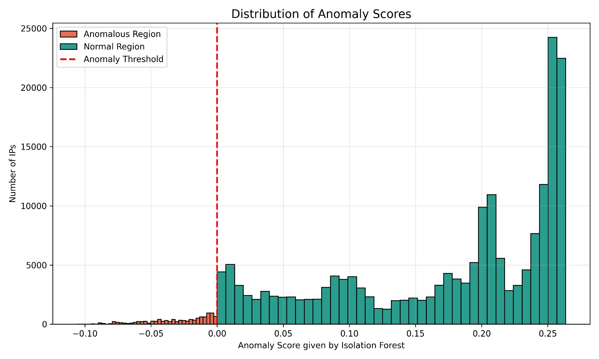
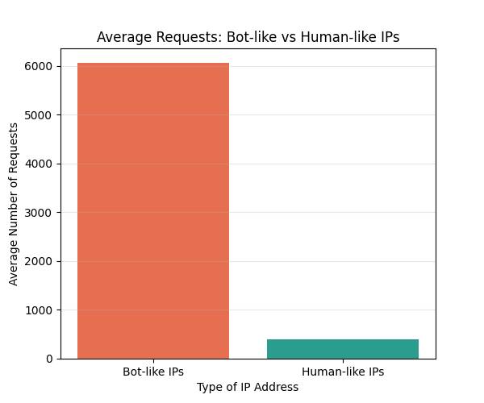
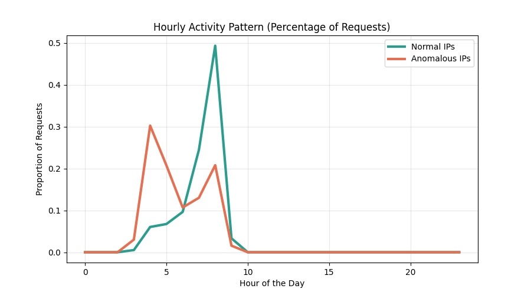
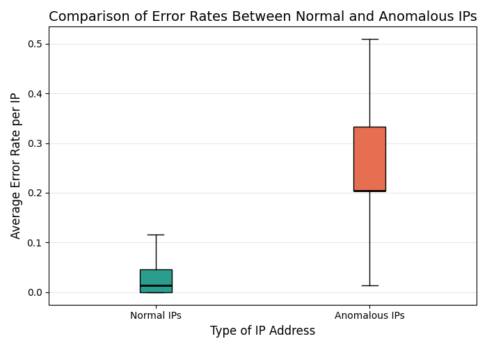

## 🛰️ Web Log Traffic Analysis and Anomaly Detection


*Detecting suspicious IP behavior from raw server logs using behavioral feature engineering and Isolation Forest.*

## 📌 Overview

Web servers receive thousands of requests from different IP addresses.
Among them are:

✦ Normal users

✦ Bots

✦ Scrapers

✦ Suspicious automated traffic

Instead of checking requests one by one, this project models how each IP behaves over time and uses machine learning to detect abnormal behavior.


## 🔄 Workflow 
Raw Logs → Cleaning → Feature Engineering (per IP) → Isolation Forest → Visual Analysis

## 🧹 Log Parsing & Cleaning

Raw logs were converted into structured data with fields such as:

✦ IP address

✦ URL accessed

✦ Status code

✦ Request size

✦ Timestamp

✦ is_bot


## 🧠 Feature Engineering

We transform the dataset from:

1 row = 1 request to 1 row = behavior summary of 1 IP

For every IP, we compute:

| Feature                | Meaning                   |
| ---------------------- | ------------------------- |
| requests_per_ip        | Traffic volume            |
| unique_urls_per_ip     | Crawling diversity        |
| error_rate_per_ip      | Suspicious probing        |
| avg_size_per_ip        | Data access pattern       |
| bot_ratio_per_ip       | Bot-like behavior         |
| hour / is_night        | Time-based activity       |
| URL structure features | API/static/query behavior |


## 🤖 Anomaly Detection — Isolation Forest
Isolation Forest detects rare and unusual patterns without labels.

✦ Negative score → Anomalous IP

✦ Positive score → Normal IP


## 📊 Visual Analytics Dashboard

### Anomaly Score Distribution


### Bot-like vs Human-like Traffic


### Requests Activity by hour 


### Error Rate: Normal vs Anomalous IPs


These visualizations clearly show how anomalous IPs behave differently from normal users.

## 🛠️ Technologies Used

✦ Python

✦ Pandas

✦ Scikit-learn

✦ Matplotlib

✦ Google Colab


## 📁 Project Structure

```
Web-Log-Traffic-Analysis-and-Anomaly-Detection/
│
├── abstract.pdf
│
├── notebooks/
│   ├── log_parsing_cleaning.ipynb
│   ├── feature_engineering.ipynb
│   ├── anomaly_model_training.ipynb
│   └── analysis_visualization.ipynb
│
├── data/
│   ├── processed_features.csv
│   └── anomaly_scores.csv
│
├── models/
│   ├── isolation_forest.pkl
│   └── scaler.pkl
│
├── plots/
│   ├── anomaly_score_distribution.png
│   ├── bot_vs_human_requests.png
│   ├── requests_vs_urls_scatter.png
│   └── error_rate_clean.png
│
├── README.md
├── requirements.txt
└── .gitignore
```

## 🎯 What This Project Demonstrates

Log analysis

Feature engineering from raw data

Unsupervised anomaly detection

Behavioral analytics

Data visualization for interpretation


