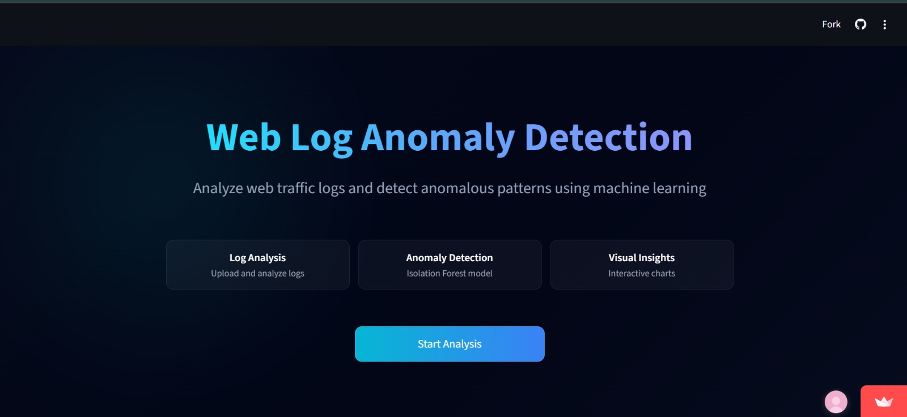
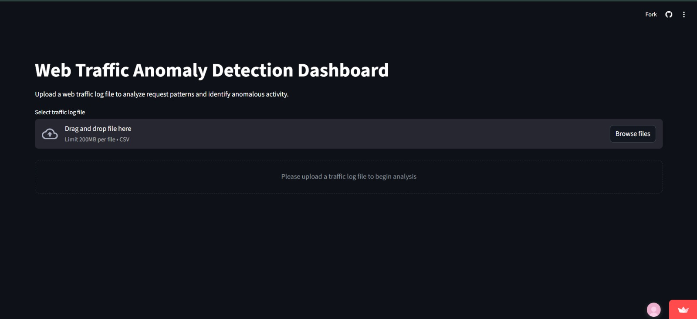
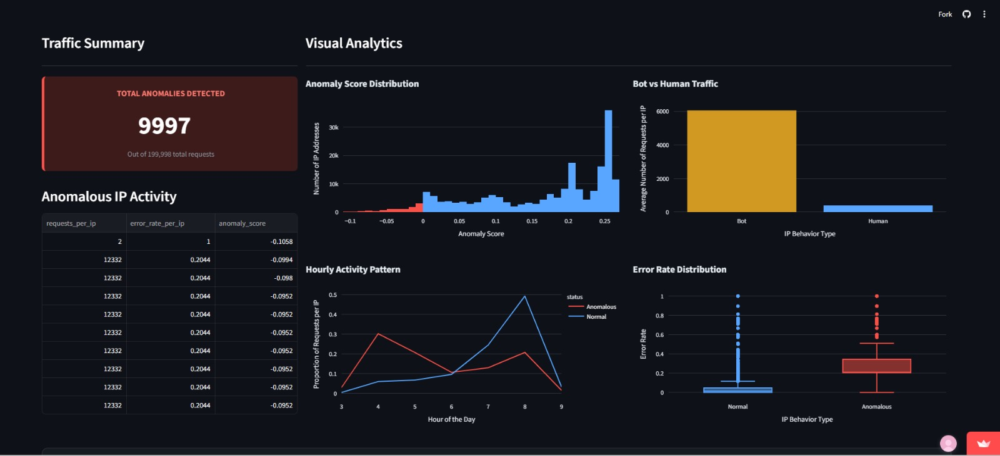
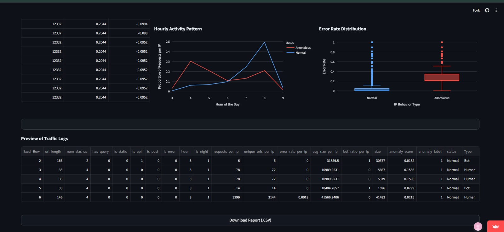

## 🌐 Web Log Traffic Analysis and Anomaly Detection

Access the deployed Streamlit application:  
🔗 https://web-traffic-anomaly-dashboard.streamlit.app/


---

## 📖 Overview

Web servers receive thousands of requests from different IP addresses.
Among them are:

✦ Normal users

✦ Bots

✦ Scrapers

✦ Suspicious automated traffic

Instead of checking requests one by one, this project models how each IP behaves over time and uses machine learning to detect abnormal behavior.

---

## 📊 Application Demo

### Landing Page


### Log Upload Interface


### Traffic Analysis Dashboard


### Anomaly Report Download


---

## 🔍 Key Features

✦ Upload web server log files for automated analysis  

✦ Identify suspicious and anomalous IP behavior  

✦ Interactive dashboard for exploring traffic patterns  

✦ Visual insights into user activity and anomalies  

✦ Download anomaly detection results and reports  

---

## ⚙️ Workflow 
Raw Logs → Cleaning → Feature Engineering (per IP) → Isolation Forest → Visual Analysis

###  Log Parsing & Cleaning

Raw logs were converted into structured data with fields such as:

✦ IP address

✦ URL accessed

✦ Status code

✦ Request size

✦ Timestamp

✦ is_bot


###  Feature Engineering

We transform the dataset from:

1 row = 1 request to 1 row = behavior summary of 1 IP

For every IP, we compute:

| Feature                | Meaning                   |
| ---------------------- | ------------------------- |
| requests_per_ip        | Traffic volume            |
| unique_urls_per_ip     | Crawling diversity        |
| error_rate_per_ip      | Suspicious probing        |
| avg_size_per_ip        | Data access pattern       |
| bot_ratio_per_ip       | Bot-like behavior         |
| hour / is_night        | Time-based activity       |
| URL structure features | API/static/query behavior |


###  Anomaly Detection — Isolation Forest
Isolation Forest detects rare and unusual patterns without labels.

✦ Negative score → Anomalous IP

✦ Positive score → Normal IP  

---


## 📁 Project Structure

```
Web-Log-Traffic-Analysis-and-Anomaly-Detection/
│
├── assets/
|   ├── dashboard.gif         # Demo video of the application
│   ├── web-log-dashboard-landing-page.jpeg
│   ├── web-log-dashboard-upload-page.jpeg
│   ├── web-log-dashboard-analysis-dashboard.jpeg
│   └── web-log-dashboard-report-download.jpeg
│
├── data/                     
│   ├── cleaned_logs.csv     
│   ├── processed_features.csv
│   └── anomaly_scores.csv
│
├── models/                   # Trained ML models
│   ├── isolation_forest.pkl
│   └── scaler.pkl
│
├── plots/                    
│   ├── anomaly_score_distribution.jpeg
│   ├── bot_vs_human_requests.png
│   ├── activity_by_hour.jpeg 
│   └── error_rate_comparision.png
│
├── programfiles/             
│   ├── log_parsing_cleaning.ipynb
│   ├── feature_engineering.ipynb
│   ├── anomaly_model_training.ipynb
│   └── analysis_visualization.ipynb
│
├── app.py                    # Streamlit Dashboard application
├── README.md                 
├── requirements.txt          
└── abstract.pdf
```
---
## 🔮 Future Improvements

✦ Real-time log monitoring support  

✦ Integration with backend APIs  

✦ Support for larger datasets and scalable processing  

✦ Advanced anomaly detection models  

✦ User authentication and access control  
